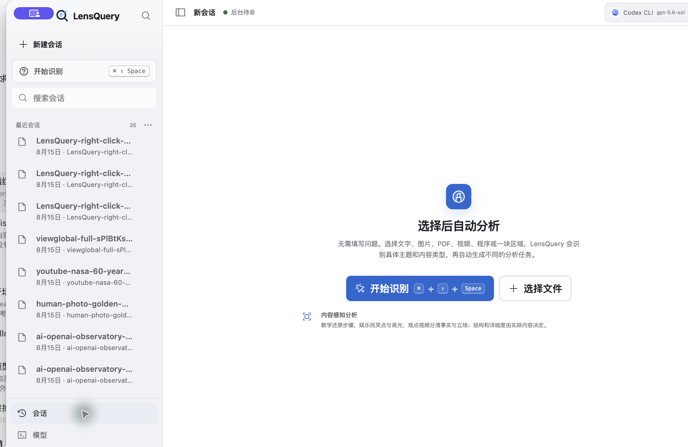
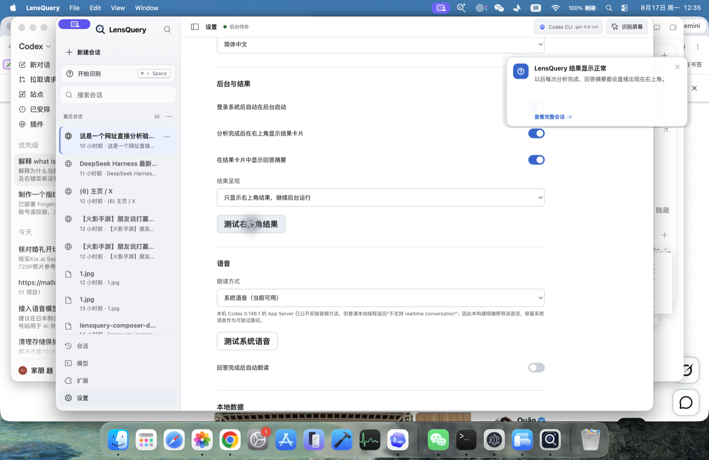

<p align="center">
  
</p>

<h1 align="center">What is it</h1>

<p align="center"><strong>Point at anything on your desktop. Get the answer without leaving the screen.</strong></p>

<p align="center">
  A resident macOS / Windows agent for the question you already ask all day:<br>
  <em>这是什么？</em>
</p>

<p align="center">
  <a href="https://github.com/Zhao73/what-is-it/stargazers"></a>
  <a href="LICENSE"></a>
  
  
  
</p>

<p align="center">
  
</p>

## Why this exists

Screenshots, copy-paste, and “open the chat app first” are the slow path.
What is it stays in the menu bar. One shortcut turns the pointer into a question mark. Click an icon, a PDF, a video, a webpage, or drag a region. The answer comes back in the upper-right card while the original screen stays visible.

| You point at | It does |
| --- | --- |
| A desktop icon, file, or control | Highlights the real object, then analyzes it |
| A webpage, YouTube / Bilibili video, or URL | Reads page context, captions, and surrounding text |
| An image or long video | Summarizes the content; provenance only when evidence exists |
| A finished answer | Shows a four-line card at the upper right, then keeps the full session locally |

The client is a quiet Codex-like workbench, not a homepage. Recognition never asks you to write a prompt.

<p align="center">
  
</p>

## Install

```bash
git clone https://github.com/Zhao73/what-is-it.git
cd what-is-it
npm run install:electron:macos
```

This builds, signs, and launches `/Applications/LensQuery.app`.

Then:

1. Leave it in the menu bar.
2. Press `⌘ ⇧ Space`.
3. Click once to highlight, click again to confirm, or hold-drag a region.
4. Load the packaged Chrome connector from `/Applications/LensQuery.app/Contents/Resources/browser-extension` and reload it once.

The first capture asks for **Screen Recording**. Object highlighting also needs **Accessibility**.

## How a query travels

```text
shortcut · tray · Finder · Chrome
              │
              ▼
     confirmed object / file / URL
              │
              ▼
     bounded local evidence
     pixels · text · captions · extract · provenance
              │
              ▼
     Codex · Claude Code · OpenCode · Grok · API
              │
              ▼
     upper-right card + local timeline
```

- Context is shown like Claude Code / Codex: `1.9k / 200k`, `Compact · 32k`, or `1m`.
- Each session can switch provider, model, reasoning, and window size without rewriting finished answers.
- Finder and Chrome both expose **使用 LensQuery 识别**. Chrome also has **分析当前网址**, the toolbar icon, and the `lq` omnibox keyword.

## Repo map

```text
src/                  React workbench
electron/             tray, shortcut, result card, settings
src-tauri/            Rust sidecar for files, capture helpers, CLI adapters
browser-extension/    Chrome / Edge connector
native/macos/         Finder Sync action
docs/                 product, architecture, acceptance
```

## Develop

```bash
npm ci
npm run check
npm run dev:electron
```

Source checks are not a live capture. Screen recording, Accessibility, Windows mixed-DPI, and packaged Finder / Chrome actions still need a real machine.

## Docs

| Doc | What it covers |
| --- | --- |
| [Product](docs/PRODUCT_SPEC.md) | What the resident tool is allowed to do |
| [Architecture](docs/ARCHITECTURE.md) | Electron workbench + Rust sidecar |
| [Implementation](docs/IMPLEMENTATION_PLAN.md) | Build sequence and remaining gates |
| [Right-click](docs/RIGHT_CLICK_ACCEPTANCE.md) | Finder, Chrome, and current-URL entries |
| [Media](docs/MEDIA_ACCEPTANCE.md) | Images, videos, and provenance limits |

## License

[MIT](LICENSE)
