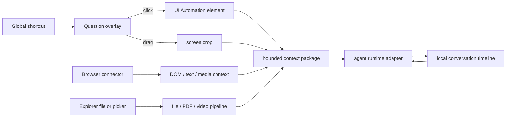

# Architecture

## Product shape

LensQuery is a resident desktop input layer, not a dashboard. The normal state is hidden in the tray. A single global shortcut switches the pointer into question mode; click selects one object and hold-drag selects a screen region. The main window exists only for the local conversation timeline, follow-ups, model routing, and settings.

## Processes and windows

- **Resident Tauri process:** owns tray, global shortcut, model processes, capture, credentials, and local storage.
- **`main` window:** a plain conversation workbench. Closing hides it; it does not terminate the resident process.
- **`capture` window:** transparent, borderless, always-on-top overlay spanning the virtual desktop. Its custom cursor is a question mark. It distinguishes a click from a drag by movement threshold.
- **Browser companion extension:** reads the explicitly clicked DOM element through `activeTab` and content-script APIs, sanitizes a bounded context package, and forwards it through a Native Messaging host.

## Agent runtime foundation

There is no single foundation used by every open-source terminal agent. Most projects combine three layers:

1. a model/provider SDK and tool loop;
2. a headless session protocol or local server;
3. a TUI/GUI client.

LensQuery should reuse layer 2 rather than embedding somebody else's terminal interface.

### Primary: Codex App Server

`codex app-server` is the first adapter because it already models the UX LensQuery needs: persistent threads, turns, items, resume/fork/list, streaming deltas, completion events, and approval requests over local JSON-RPC/JSONL. The adapter owns one process and maps one LensQuery timeline item to a Codex thread.

### Secondary: OpenCode Server / SDK

OpenCode exposes a headless HTTP server, OpenAPI schema, SDK, SSE event stream, and session endpoints. It is the provider-neutral second adapter and a good fit when the user already configured several model vendors in OpenCode.

### Interoperability: ACP

Agent Client Protocol is the portable adapter boundary for ACP-compatible agents. It keeps the desktop client independent from a specific terminal rendering implementation. A bounded CLI adapter remains a fallback for installed tools without a stable session protocol.

### Explicit non-choice

The production application does not use Ink, Bubble Tea, Ratatui, or another TUI as its UI foundation. Those libraries are appropriate for terminal rendering; LensQuery is a native resident desktop surface. Tauri/Rust remains the shell, and agent servers remain the execution foundation.

## Capture pipeline

1. The global shortcut calls `request_capture` from Rust.
2. The capture window covers all monitors using virtual-screen coordinates.
3. Pointer up yields either a one-pixel element probe or a dragged rectangle.
4. LensQuery hides its overlay before acquiring pixels.
5. On Windows, UI Automation resolves the click to a role, name, class, AutomationId, true element rectangle, and word/paragraph/document range when exposed. On macOS, Accessibility reads bounded `AXSelectedText`, `AXValue`, or title context when the user grants permission.
6. XCap captures the bounded region to a local temporary PNG.
7. The main process receives `lensquery://evidence-ready` and immediately creates a pending conversation.
8. The selected agent adapter receives the evidence and streams/returns the answer.
9. LensQuery follows the configured result presentation: permission-independent upper-right card, conversation window, or both. The same local conversation remains ready for follow-up.

Native accessibility is best-effort and permission-bound. Canvas applications, protected surfaces, elevated/secure windows, and some GPU/video surfaces may expose no useful element metadata. The pixel crop remains the fallback. The overlay supports pointer selection plus keyboard move/resize/confirm/cancel.

## Browser context

The extension collects only after the user explicitly invokes it:

- URL and page title;
- selection/word/paragraph/page/object scope, clicked tag, role, text, accessible name, and selector;
- optional user annotation plus requested analysis mode and output format;
- sanitized bounded `outerHTML` and nearby section text;
- for `video` / `audio`: current time, duration, source URL when exposed, and paused state.

The default extension uses `activeTab`, `scripting`, and `nativeMessaging`. Source/network inspection through `chrome.debugger` is deliberately a separate opt-in capability because it carries a stronger permission warning. It should be enabled only for an explicit “深入分析页面” action, never for every click.

## Local files and video

- File selection/drop enters the same timeline without a separate upload homepage.
- Images go directly to vision-capable adapters.
- Video is locally probed and automatically prepared into time-coded frames plus an optional compact audio derivative before the model request.
- Machine-readable PDFs and text/code files use bounded local extraction. Image-only PDFs remain an OCR milestone.
- Explorer integration can forward a selected path through a protocol activation or shell verb; it remains a packaging milestone.

## Security boundaries

- No background surveillance or periodic capture.
- Capture occurs only after the explicit shortcut and pointer action.
- API secrets stay in the OS credential vault.
- CLI fallback uses fixed executable allowlists and argument arrays, never a shell command string.
- Browser HTML is bounded and strips common secret-bearing attributes and scripts before transport.
- Agent tool permissions stay disabled for ordinary visual explanation. A later source-code workspace mode must be a distinct, explicit user action.
- Optional outbound preview pauses the request with a removable context summary; disabling it restores the one-shortcut direct path.
- Captured PNGs are deleted after the request unless retention is enabled. History and image retention are independent settings.
