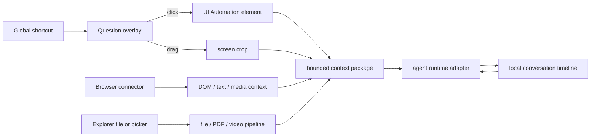

# Architecture

## Product shape

LensQuery is a resident desktop input layer, not a dashboard. The normal state is hidden in the tray. A single global shortcut switches the pointer into question mode; click selects one object and hold-drag selects a screen region. The main window exists only for the local conversation timeline, follow-ups, model routing, and settings.

## Processes and windows

- **Resident Electron main process:** owns the tray, global shortcut, window lifecycle, macOS `desktopCapturer` permission/pixel acquisition, OS notifications/speech, login item, encrypted secret storage, file dialogs, browser-queue handoff, and extension manager.
- **Sandboxed renderer:** React/TypeScript workbench loaded with `contextIsolation`, `sandbox`, no Node integration, and a channel allowlist exposed by `preload.cjs`.
- **Rust sidecar:** the existing `lensquery` binary starts with `--electron-sidecar`, accepts one bounded JSON request on stdin, returns one JSON envelope on stdout, then exits. It owns Accessibility/UI Automation, local file/PDF/video preparation, CLI discovery, CLI analysis, and the legacy Tauri/XCap capture path. It does not expose a listening port. Electron supplies monitor geometry during macOS target inspection, so the helper does not touch the screen-capture API.
- **`main` window:** a coding-agent-style conversation workbench. Closing hides it and its Dock presence; it does not terminate the resident tray process.
- **`capture` window:** transparent, borderless, always-on-top Electron overlay spanning the virtual desktop. Its custom cursor is a question mark. It distinguishes a click from a drag by movement threshold, delegates target inspection to the Rust sidecar, then asks the resident Electron process for the confirmed crop.
- **Browser companion extension:** reads the explicitly clicked DOM element through `activeTab` and content-script APIs, sanitizes a bounded context package, and forwards it through a Native Messaging host.
- **Tauri migration fallback:** remains buildable and installed separately while Electron permission attribution, mixed-DPI selection, and packaged sidecar behavior are verified. It is not the target client architecture.

## Agent runtime foundation

There is no single foundation used by every open-source terminal agent. Most projects combine three layers:

1. a model/provider SDK and tool loop;
2. a headless session protocol or local server;
3. a TUI/GUI client.

LensQuery should reuse layer 2 rather than embedding somebody else's terminal interface.

### Primary: Codex App Server

`codex app-server` is the first adapter because it already models the UX LensQuery needs: persistent threads, turns, items, resume/fork/list, streaming deltas, completion events, and approval requests over local JSON-RPC/JSONL. The adapter owns one process and maps one LensQuery timeline item to a Codex thread.

### Secondary: OpenCode Server / SDK

OpenCode exposes a headless HTTP server, OpenAPI schema, SDK, SSE event stream, and session endpoints. It is the provider-neutral second adapter and a good fit when the user already configured several model vendors in OpenCode.

### Interoperability: ACP

Agent Client Protocol is the portable adapter boundary for ACP-compatible agents. It keeps the desktop client independent from a specific terminal rendering implementation. A bounded CLI adapter remains a fallback for installed tools without a stable session protocol.

### Explicit non-choice

The production application does not use Ink, Bubble Tea, Ratatui, or another TUI as its UI foundation. Those libraries are appropriate for terminal rendering; LensQuery is a resident desktop surface. Electron is the client shell, Rust remains the native capability core, and agent servers remain the planned long-lived execution foundation.

## Capture pipeline

1. The Electron global shortcut opens the transparent capture renderer and sends it the persisted capture intent.
2. The capture window covers all monitors using virtual-screen coordinates.
3. A click temporarily hides the overlay, resolves the underlying accessibility/file target, then restores the overlay around the real bounds; a second click confirms it. A dragged rectangle bypasses this target-confirmation step.
4. LensQuery hides its overlay before target inspection and final pixel acquisition. The capture renderer explicitly clears the normal app/root canvas, so transparent pixels reveal the unchanged desktop instead of an opaque dark window.
5. On Windows, UI Automation resolves the click to a role, name, class, AutomationId, true element rectangle, and word/paragraph/document range when exposed. On macOS, Accessibility reads bounded `AXSelectedText`, `AXValue`, or title context when the user grants permission.
6. On packaged macOS Electron, `desktopCapturer` acquires the selected display once under the stable app identity and crops the confirmed logical bounds at the display scale factor. Windows uses the XCap platform path; Tauri remains source-only comparison code.
7. Electron writes the bounded PNG locally, combines it with sidecar Accessibility metadata, emits `lensquery://evidence-ready`, and the renderer immediately creates a pending conversation.
8. The selected agent adapter receives the evidence and streams/returns the answer.
9. LensQuery follows the configured result presentation: permission-independent upper-right card, conversation window, or both. The local conversation keeps the selected image/file metadata, full answer, media quick actions, and follow-up context.

Native accessibility is best-effort and permission-bound. Canvas applications, protected surfaces, elevated/secure windows, and some GPU/video surfaces may expose no useful element metadata. The pixel crop remains the fallback. The overlay supports pointer selection plus keyboard move/resize/confirm/cancel.

The macOS installer signs the embedded sidecar with `com.lensquery.desktop.electron-preview.sidecar` before re-signing the parent bundle. With an Apple Development identity this yields a stable designated requirement instead of a per-build CDHash, preventing local upgrades from appearing as a different helper to TCC.

## Browser context

The extension collects only after the user explicitly invokes it:

- native right-click source (`selection`, `image`, `video`, or `page`);
- URL and page title;
- selection/word/paragraph/page/object scope, clicked tag, role, text, accessible name, and selector;
- optional user annotation plus requested analysis mode and output format;
- sanitized bounded `outerHTML` and nearby section text;
- for `video` / `audio`: current time, duration, source URL when exposed, paused state, visible captions, page-published YouTube caption tracks, already-open generic transcript segments, cue count, and an explicit transcript-truncation marker;
- a bounded compressed target crop when visible-tab capture is permitted. The native host rejects incoming local paths and writes only validated JPEG/PNG/WebP bytes to LensQuery's temporary capture directory.

The default extension uses `activeTab`, `contextMenus`, `scripting`, and `nativeMessaging`, with no persistent all-sites content script. Source/network inspection through `chrome.debugger` is deliberately a separate opt-in capability because it carries a stronger permission warning. It should be enabled only for an explicit “深入分析页面” action, never for every click.

## Local files and video

- File selection/drop enters the same timeline without a separate upload homepage.
- Images go to vision-capable adapters after local common-EXIF extraction and C2PA Content Credentials validation. C2PA structure, asset binding, signature, and signer trust use a release-pinned official trust-list snapshot; visible watermark reading and visual AI-style inference remain separate evidence classes.
- Video is locally probed and automatically prepared into time-coded frames plus a compact mono audio derivative before the model request. Same-name `.vtt`/`.srt` files are preferred; when absent, an available local Whisper CLI produces bounded time-coded text. Whisper model/device/language are locally configurable through environment variables and the default multilingual model is `base`.
- Transcript-bearing videos at least 20 minutes long are divided into at most 12 chronological evidence chapters. The prompt contract requires whole-ledger coverage, named entities, facts/data/examples, facts-versus-opinion separation, important timestamps, and explicit gaps. Short videos keep the low-latency compact path.
- For an explicitly selected HTTPS YouTube video, page-published captions remain the fastest path. If absent, the desktop sidecar may call local `yt-dlp` with no-playlist, four-hour, 1.5-GB, and HTTPS/hostname bounds, then reuse the same local frame/audio/Whisper pipeline. The selected public URL is the only network input; model CLIs remain tool- and network-disabled.
- Machine-readable PDFs and text/code files use bounded local extraction. Image-only PDFs remain an OCR milestone.
- Explorer integration can forward a selected path through a protocol activation or shell verb; it remains a packaging milestone.

## Security boundaries

- No background surveillance or periodic capture.
- Capture occurs only after the explicit shortcut and pointer action.
- API secrets stay in the OS credential vault.
- CLI fallback uses fixed executable allowlists and argument arrays, never a shell command string.
- The Codex fallback prefers the native executable, removes inherited parent-agent session IDs, and uses a private LensQuery `CODEX_HOME`/`CODEX_SQLITE_HOME`. It links the user's configuration/authentication inputs but keeps LensQuery analysis state separate from the user's Codex conversation/history databases.
- CLI stdin is explicitly closed after the bounded prompt; stdout/stderr are collected independently; timeouts terminate the complete subprocess group so npm/Node wrappers cannot leave native agent children behind.
- Browser HTML is bounded and strips common secret-bearing attributes and scripts before transport.
- Agent tool permissions stay disabled for ordinary visual explanation. A later source-code workspace mode must be a distinct, explicit user action.
- Optional outbound preview pauses the request with a removable context summary; disabling it restores the one-shortcut direct path.
- Preload exposes only named IPC methods/events. The renderer has no filesystem, process, or shell access.
- Electron API secrets are encrypted with `safeStorage`; desktop JSON stores only ciphertext and non-secret state.
- Plugin and Skill installation accepts a local directory or Git repository, rejects symbolic links, skips VCS/dependency trees, and limits copied content to 800 files / 32 MB.
- Managed Skills install to `~/.codex/skills`; existing `~/.agents/skills` packages are discovered read-only. Removal uses the operating-system Trash.
- Enabled packages contribute bounded Markdown instructions only (12,000 characters each, 40,000 total). JavaScript, shell files, and manifest-declared permissions are never executed by the extension manager.
- Captured PNGs are deleted after the request unless retention is enabled. History and image retention are independent settings.
