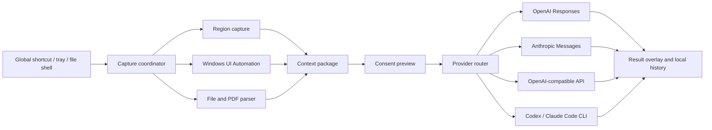

# LensQuery implementation plan

## Release definition

The first public release is a Windows-first open-source desktop application that can:

1. run in the system tray;
2. register configurable global shortcuts;
3. open a full-desktop selection overlay;
4. capture a clicked UI element or dragged rectangular region;
5. accept local images, videos, PDFs, and text-oriented files;
6. preview exactly what will be submitted;
7. send multimodal requests through OpenAI, Anthropic, or an OpenAI-compatible endpoint;
8. optionally invoke an installed Codex or Claude Code CLI in non-interactive analysis mode;
9. show, copy, and continue an answer in a compact result window;
10. keep secrets in the operating-system credential store and history locally.

## Architecture

## Milestones

### M0: Repository and contracts

- Tauri 2, React, TypeScript, Vite, Rust workspace.
- MIT license, contribution guide, security policy, code of conduct, issue templates, CI.
- Typed contracts for capture, attachments, provider profiles, requests, responses, and settings.
- Provider and platform services are interface-driven so Windows-specific code does not leak into UI components.

### M1: Working application shell

- Fluent-inspired Windows desktop UI with dashboard, history, and settings routes.
- Tray menu, show/hide behavior, single-instance handling, and launch-at-login setting.
- Global shortcut registration through the official Tauri plugin.
- Local settings persistence; API keys represented only by credential references.

### M2: Capture modes

- Full-screen transparent overlay covering all monitors.
- Drag selection with size readout, cancel, retry, and confirm.
- Click inspection that queries UI Automation at the pointer and captures its bounding rectangle.
- Screen capture implementation behind `CaptureBackend`, with a deterministic mock backend for non-Windows development and tests.
- Privacy preview with image cropping and removable context fields.

### M3: Files and PDFs

- Drag-and-drop and native file picker.
- Image normalization and metadata stripping.
- PDF metadata/text extraction plus bounded page rendering when needed.
- Text-oriented file preview with size/type limits, binary detection, and truncation notice.
- Optional Windows Explorer `Send to LensQuery` integration after the core path is stable.

### M3.5: Video fast analysis

- Local FFprobe metadata inspection with clear missing-runtime recovery.
- Duration-aware extraction of 3-24 timestamped frames, downscaled before provider submission.
- Optional compact audio extraction and transcription when the selected route declares support.
- Evidence preview that exposes each derivative artifact rather than uploading the original video invisibly.
- Prompts that return summary, key moments, visible text/objects, transcript findings, and a customer-ready answer.

### M4: AI routing

- OpenAI Responses adapter using image data URLs and direct file inputs where supported.
- Anthropic Messages adapter using base64 image/document blocks where supported.
- OpenAI-compatible adapter with configurable base URL, headers, model ID, and vision capability toggle.
- CLI adapters: executable discovery, bounded timeout, sanitized environment, non-interactive arguments, stdout/stderr parsing, and no tool permissions by default.
- Streaming normalized into provider-independent events.

### M5: Answer workflow

- Compact always-on-top result overlay near the capture region.
- Fast-answer template for customer support: observation, likely meaning, suggested reply, and uncertainty.
- General explain, translate, troubleshoot, compare, and custom prompts.
- Copy answer, copy source evidence, follow up, open full history, retry with another model.

### M6: Hardening and distribution

- Windows 10/11 multi-monitor and DPI tests.
- Keyboard-only and high-contrast tests.
- Secret-redaction and outbound-payload snapshot tests.
- Crash recovery, timeouts, cancellation, offline errors, rate-limit guidance.
- Signed MSIX/NSIS release workflow left ready for maintainer certificates; unsigned development artifacts remain clearly labeled.

## Security and privacy boundaries

- The capture overlay never uploads automatically.
- The preview lists image regions, extracted text, filenames, window metadata, and endpoint host.
- Password-like fields discovered through UI Automation are omitted.
- Raw API keys are written only to Windows Credential Manager, macOS Keychain, or Linux Secret Service through the keyring abstraction.
- Local CLI adapters receive read-only prompt/file context. They do not receive broad working-directory access unless the user deliberately selects a folder.
- History defaults to local metadata plus answer; retaining screenshots is opt-in.
- Diagnostic logs redact authorization headers, key-like strings, file contents, and image payloads.

## Verification matrix

| Layer | Check |
| --- | --- |
| TypeScript | `pnpm typecheck`, ESLint, Vitest |
| React UI | component tests, keyboard interactions, empty/loading/error states |
| Rust core | `cargo fmt --check`, `cargo clippy`, `cargo test` |
| Contract | serialized request/response fixtures and outbound-payload snapshots |
| Build | `pnpm build`, `pnpm tauri build --debug` on Windows CI |
| Runtime | Windows 10/11, 100/125/150/200% DPI, mixed-DPI monitors |
| Providers | mocked HTTP contract tests; live checks only with maintainer secrets |
| Packaging | Windows artifact smoke install/uninstall and tray/shortcut verification |

## Deferred scope

- Browser extension for exact URL, DOM, accessibility tree, and selected text.
- OCR engine bundled for fully offline recognition.
- Team-managed provider policies and shared prompt libraries.
- Automated customer-message sending. LensQuery drafts and copies answers; an external send remains a distinct user action.
